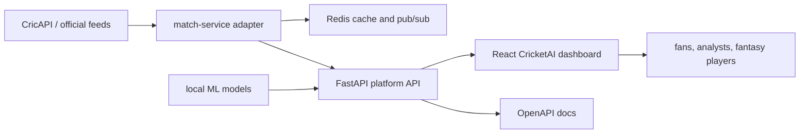

# CricketAI Architecture

## Implemented Now

- `frontend`: React dashboard for CricketAI live intelligence, prediction, simulation, analytics, and fantasy workspaces.
- `backend`: FastAPI service with local ML pickles, Pydantic-typed platform endpoints, CricAPI-ready live match adapter, and OpenAPI docs.
- `ml`: Local trained next-ball assets used by the prediction endpoints.
- `data_pipeline`: Utility scripts for Cricsheet ingestion and fantasy catalog generation.
- `docker-compose.yml`: Local stack with frontend, backend, Redis, PostgreSQL, and MongoDB.

## Target Services

- `auth-service`: JWT, OAuth2, refresh token rotation, RBAC, and 2FA.
- `match-service`: Live score ingestion, WebSocket fanout, Redis cache, and Kafka events.
- `prediction-service`: FastAPI model serving with MLflow-backed model loading.
- `user-service`: Profiles, follows, prediction leagues, fantasy teams, and preferences.
- `notification-service`: FCM, email, SMS, and turning-point alerts.
- `analytics-service`: PostgreSQL read replica plus ClickHouse OLAP explorer.
- `llm-gateway`: AI commentary, chatbot, scouting reports, and token metering.

## Data Flow

## Security Baseline

- No hardcoded production secrets.
- External API keys are read from environment variables.
- Pydantic validates new platform/auth request and response contracts.
- Betting intelligence is documented as gated behind 18+ and responsible-play controls.
